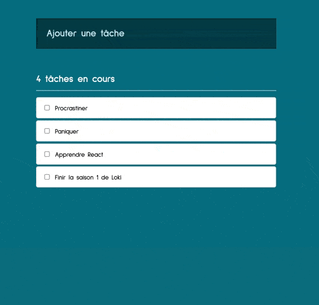

# todo-list-React

Cette application permet de créer une liste de tâche, d'en ajouter et de les cocher une fois terminées.

## Réalisation

J'ai réalisé ce projet après ma formation en développement web FS JavaScript.

Il s'agit de mon premier projet codé en React.js

## Language utilisé

- JavaScript / JSX
- HTML
- CSS / SCSS

## Stacks

- React.js
  - babel
  - webpack

## Overview



## Installation

**Pré-requis**

- [yarn](https://classic.yarnpkg.com/en/docs/install/#mac-stable)

1. Cloner le repo 
- en utilisant la clé SSH
```
git clone git@github.com:sarah-maau/todo-list-React.git
```
- en utilisant HTTPS
```
git clone https://github.com/sarah-maau/todo-list-React.git
```

2. Installer les dépendances
```
yarn
```

3. Lancer le script
```
yarn start
```

## Auteur

Sarah Maury - [GitHub](https://github.com/sarah-maau) - [LinkedIn](https://www.linkedin.com/in/sarah-maury-dev/)

## Licence

Ce projet est sous licence MIT - voir le fichier `LICENSE` pour plus de détails
